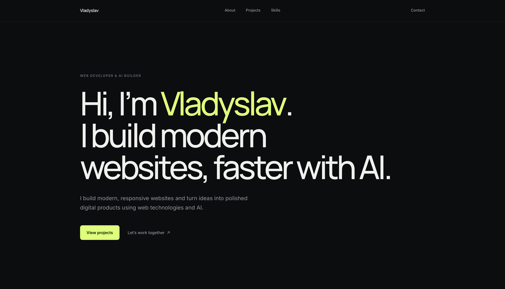

# Vladyslav — Portfolio

A personal portfolio website that showcases my work, skills, and contact
information. It has a clean, modern interface and is optimized for both desktop
and mobile.

**Live demo:** [crjfc2vsy2-maker.github.io/portfolio](https://crjfc2vsy2-maker.github.io/portfolio/)



## Technologies

- HTML
- CSS
- JavaScript
- Git
- GitHub
- GitHub Pages

## Key features

- **Responsive design** — adapts cleanly from small phones to large desktops.
- **Mobile navigation** — accessible burger menu that closes on selection,
  `Escape`, outside click, or when returning to desktop width.
- **Data-driven projects section** — projects are defined as objects in
  `script.js` and the cards are generated from that data. Adding a project means
  adding one object.
- **Clickable contacts** — Telegram, email, and WhatsApp links open the right
  app or a new message.

## Run locally

No build step is required — it is a static site. After cloning, you can simply
open `index.html` directly in your browser.

```bash
git clone https://github.com/crjfc2vsy2-maker/portfolio.git
cd portfolio
```

Optionally, for a more convenient local setup, serve it over HTTP:

```bash
python3 -m http.server 8000
```

Then open http://localhost:8000/ in your browser.

## Project status

In Progress — actively being improved and expanded.

## Author

Vladyslav
